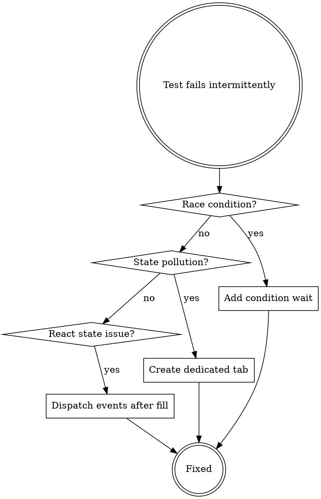

# Browser Testing with Claude-in-Chrome

## Overview

**Core principle:** Every browser test must have dedicated tab isolation, condition-based waiting, and React-safe form handling.

Claude-in-Chrome MCP tools enable parallel browser automation. Each test gets its own Chrome tab via `tabId`, allowing multiple tests to run simultaneously without interference.

## When to Use

**Use when:**
- Writing e2e tests for web applications
- Automating browser interactions with Claude-in-Chrome
- Debugging flaky tests (race conditions, timing issues, state pollution)
- Running tests in parallel (multiple subagents simultaneously)
- Testing React or other SPA frameworks
- Need visual verification (screenshots)

**When NOT to use:**
- Backend-only API tests (use requests/httpx)
- Unit tests (use pytest/jest)
- Chrome DevTools MCP (not parallelizable - use Claude-in-Chrome instead)

## Quick Reference

| Pattern | Tool | Key Point |
|---------|------|-----------|
| **Load tools** | `ToolSearch("claude-in-chrome")` | MANDATORY before any browser tool |
| **Get context** | `tabs_context_mcp(createIfEmpty=true)` | First call in every test |
| **Create tab** | `tabs_create_mcp()` | Returns `{tabId: 123}` - use this ID everywhere |
| **Navigate** | `navigate(url, tabId)` | Always pass your tabId |
| **Find element** | `find(query, tabId)` | Natural language (e.g., "email input") |
| **Fill React form** | See React-Safe Fill Pattern below | MUST dispatch events |
| **Click** | `computer(action="left_click", ref=..., tabId)` | Use ref from find() |
| **Wait condition** | See Condition-Based Waiting Pattern | NO built-in wait_for |
| **Screenshot** | `computer(action="screenshot", tabId)` | Returns image_id |
| **Check console** | `read_console_messages(tabId, pattern="error")` | Filter with regex |
| **Check network** | `read_network_requests(tabId, urlPattern="/api/")` | Filter by URL |

## Critical First Step

**BEFORE any browser interaction**, you MUST:

```python
# Step 1: Load tools (only first time in session)
ToolSearch(query="claude-in-chrome", max_results=20)

# Step 2: Get context (every test)
context = mcp__claude-in-chrome__tabs_context_mcp(createIfEmpty=true)

# Step 3: Create YOUR dedicated tab (every test)
new_tab = mcp__claude-in-chrome__tabs_create_mcp()
tab_id = new_tab['tabId']  # THIS is your tabId - pass it to EVERY tool call
```

**Never reuse tabs from other tests/agents.** Each test creates its own tab for complete isolation.

## React-Safe Fill Pattern

**Problem:** `form_input` sets DOM value directly, bypassing React's state. Form submits with empty values.

**Solution:** Dispatch synthetic events after filling:

```python
# Step 1: Find the input
email_field = mcp__claude-in-chrome__find(
    query="email input",
    tabId=tab_id
)

# Step 2: Fill it
mcp__claude-in-chrome__form_input(
    ref=email_field['elements'][0]['ref'],
    value="user@example.com",
    tabId=tab_id
)

# Step 3: Trigger React state update
mcp__claude-in-chrome__javascript_tool(
    action="javascript_exec",
    text="""
        const input = document.querySelector('input[name="email"]');
        const setter = Object.getOwnPropertyDescriptor(
            window.HTMLInputElement.prototype, 'value'
        ).set;
        setter.call(input, input.value);
        input.dispatchEvent(new Event('input', { bubbles: true }));
        input.dispatchEvent(new Event('change', { bubbles: true }));
    """,
    tabId=tab_id
)
```

**For textareas:** Replace `HTMLInputElement` with `HTMLTextAreaElement`.

## Condition-Based Waiting Pattern

**Problem:** NO `wait_for` tool exists. Fixed sleeps are brittle.

**Solution:** Build retry loop with `javascript_tool` for condition checking:

```python
import time

def wait_for_condition(tab_id: int, condition_js: str, timeout: int = 10):
    """
    Poll JS condition until true or timeout.

    Args:
        condition_js: JS expression that returns boolean (e.g., "!window.location.href.includes('/auth')")
        timeout: Seconds to wait before failing

    Raises:
        TimeoutError: If condition not met within timeout
    """
    start = time.time()
    poll_interval = 0.5

    while time.time() - start < timeout:
        result = mcp__claude-in-chrome__javascript_tool(
            action="javascript_exec",
            text=condition_js,
            tabId=tab_id
        )

        if result:  # Condition met
            return True

        # Sleep before retry
        mcp__claude-in-chrome__computer(
            action="wait",
            duration=poll_interval,
            tabId=tab_id
        )

    raise TimeoutError(f"Condition not met: {condition_js}")

# Usage: Wait for URL change after login
wait_for_condition(
    tab_id=tab_id,
    condition_js="window.location.pathname.includes('/dashboard')",
    timeout=10
)
```

**Common conditions:**
- URL change: `"window.location.href.includes('/new-page')"`
- Element exists: `"!!document.querySelector('#target')"`
- Element visible: `"document.querySelector('#target').offsetParent !== null"`
- Ajax complete: `"window.fetch === undefined || !window.fetch.pending"`

## Parallel Execution (Critical for Performance)

**When running multiple tests:** Spawn parallel subagents, each creates its own tab.

```python
# ❌ BAD: All agents share one tab (race conditions)
shared_tab_id = 123
Agent1: navigate(url="/test1", tabId=shared_tab_id)
Agent2: navigate(url="/test2", tabId=shared_tab_id)  # Clobbers Agent1

# ✅ GOOD: Each agent has dedicated tab
Agent1:
    my_tab = tabs_create_mcp()
    navigate(url="/test1", tabId=my_tab['tabId'])

Agent2:
    my_tab = tabs_create_mcp()
    navigate(url="/test2", tabId=my_tab['tabId'])
```

**Orchestration example:**
```python
# Spawn 5 agents in parallel (single message with multiple Task calls)
for test in [test1, test2, test3, test4, test5]:
    Task(
        subagent_type="general-purpose",
        prompt=f"""
        Run test: {test['name']}

        CRITICAL: Create YOUR OWN tab:
        1. tabs_context_mcp(createIfEmpty=true)
        2. my_tab = tabs_create_mcp()
        3. Use my_tab['tabId'] for ALL browser tools

        Test steps: {test['steps']}
        """
    )
```

## Complete Example: Login Test

```python
# 1. Load tools (first time only)
ToolSearch(query="claude-in-chrome", max_results=20)

# 2. Create dedicated tab
context = mcp__claude-in-chrome__tabs_context_mcp(createIfEmpty=true)
tab = mcp__claude-in-chrome__tabs_create_mcp()
tab_id = tab['tabId']

# 3. Navigate to login page
mcp__claude-in-chrome__navigate(
    url="http://localhost:3000/auth",
    tabId=tab_id
)

# 4. Screenshot initial state
mcp__claude-in-chrome__computer(
    action="screenshot",
    tabId=tab_id
)

# 5. Find and fill email (React-safe)
email = mcp__claude-in-chrome__find(query="email input", tabId=tab_id)
mcp__claude-in-chrome__form_input(
    ref=email['elements'][0]['ref'],
    value="user@test.com",
    tabId=tab_id
)
# Trigger React events
mcp__claude-in-chrome__javascript_tool(
    action="javascript_exec",
    text="""
        const input = document.querySelector('input[type="email"]');
        input.dispatchEvent(new Event('input', { bubbles: true }));
        input.dispatchEvent(new Event('change', { bubbles: true }));
    """,
    tabId=tab_id
)

# 6. Find and fill password (same pattern)
pwd = mcp__claude-in-chrome__find(query="password input", tabId=tab_id)
mcp__claude-in-chrome__form_input(
    ref=pwd['elements'][0]['ref'],
    value="SecurePass123",
    tabId=tab_id
)
mcp__claude-in-chrome__javascript_tool(
    action="javascript_exec",
    text="""
        const input = document.querySelector('input[type="password"]');
        input.dispatchEvent(new Event('input', { bubbles: true }));
        input.dispatchEvent(new Event('change', { bubbles: true }));
    """,
    tabId=tab_id
)

# 7. Click Sign In button
btn = mcp__claude-in-chrome__find(query="sign in button", tabId=tab_id)
mcp__claude-in-chrome__computer(
    action="left_click",
    ref=btn['elements'][0]['ref'],
    tabId=tab_id
)

# 8. Wait for redirect (condition-based, not fixed sleep)
wait_for_condition(
    tab_id=tab_id,
    condition_js="!window.location.pathname.includes('/auth')",
    timeout=10
)

# 9. Verify we're on dashboard
current_url = mcp__claude-in-chrome__javascript_tool(
    action="javascript_exec",
    text="window.location.pathname",
    tabId=tab_id
)
assert "/dashboard" in current_url or "/project" in current_url

# 10. Screenshot success state
mcp__claude-in-chrome__computer(
    action="screenshot",
    tabId=tab_id
)

# 11. Check for console errors
errors = mcp__claude-in-chrome__read_console_messages(
    tabId=tab_id,
    pattern="error|exception",
    onlyErrors=true
)
assert len(errors) == 0, f"Console errors: {errors}"

print("✅ Login test PASSED")
```

## Common Mistakes

| Mistake | Why It Fails | Fix |
|---------|--------------|-----|
| **Reuse tab across tests** | State pollution, race conditions | Create new tab per test |
| **`form_input` without events** | React doesn't see value change | Dispatch input/change events |
| **Fixed `computer(action="wait", duration=5)`** | Brittle timing, fails under load | Use condition-based retry loop |
| **No `tabId` parameter** | Tool call fails | EVERY browser tool needs tabId |
| **Shared tab in parallel tests** | Agents stomp on each other | One tab per agent |
| **Check URL immediately after click** | Async navigation not complete | Wait for condition with retry |
| **Forget `ToolSearch` first** | Tools not loaded, undefined error | Always load tools before use |
| **Use Chrome DevTools MCP** | Singleton page, no parallelism | Use Claude-in-Chrome instead |

## Debugging Flaky Tests



## Real-World Impact

**Before skill:**
- 12 e2e tests run sequentially in ~6 minutes
- 3 tests flaky due to race conditions
- Form submissions fail on React apps

**After skill:**
- 12 tests run in parallel in ~1 minute (6x faster)
- 100% pass rate with condition-based waiting
- React forms work reliably with event dispatching
