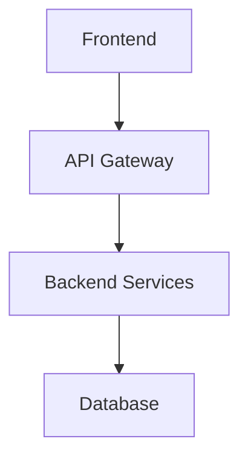
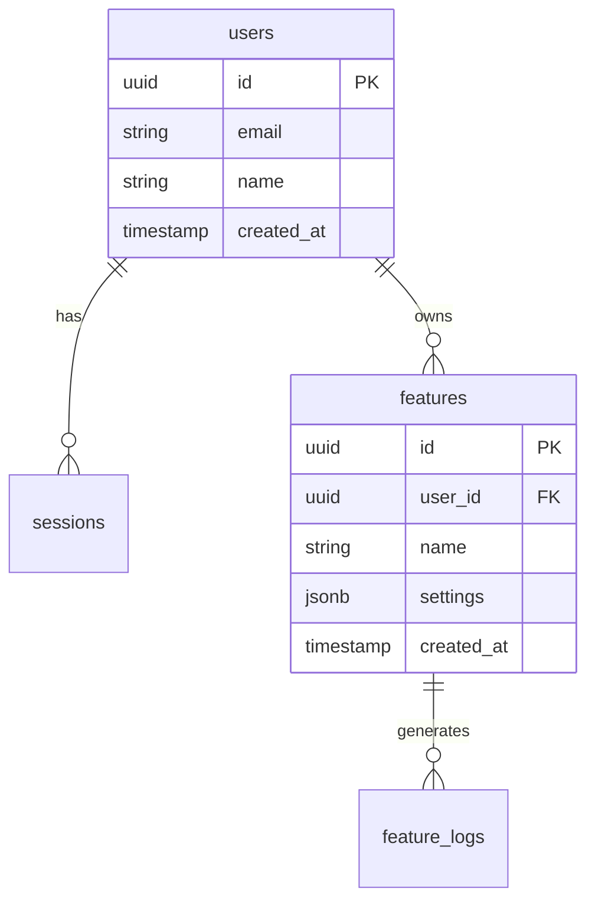
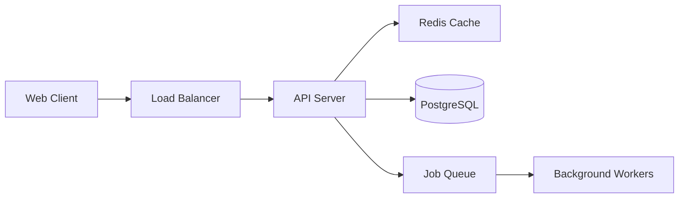
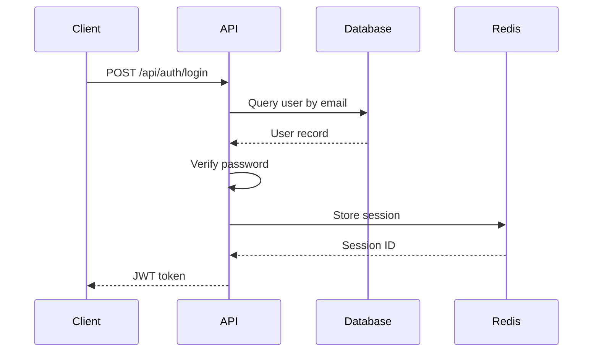

# Architecture Plan: [Project Name]

## 1. System Overview
- **Purpose**: [What this system does]
- **Tech Stack**:
  - Frontend: [frameworks, libraries]
  - Backend: [frameworks, languages]
  - Database: [type, version]
  - Infrastructure: [hosting, services]
- **High-level Architecture**:



## 2. Directory Structure Map
```
/src
  ├── /frontend - React application
  │   ├── /components - Reusable UI components
  │   ├── /pages - Route-level pages
  │   └── /services - API clients
  ├── /backend - Node.js API server
  │   ├── /controllers - Request handlers
  │   ├── /services - Business logic
  │   └── /models - Database models
  └── /database - Schema and migrations
```

## 3. Feature-to-Code Mapping

### Feature: [Feature Name]
- **User-facing capability**: [What users can do]
- **Entry point**: `GET /api/feature`
- **Code path**:
  - Route: `backend/routes/feature.routes.ts:15`
  - Controller: `backend/controllers/feature.controller.ts:23`
  - Service: `backend/services/feature.service.ts:45`
  - Model: `backend/models/feature.model.ts:12`
- **Database tables used**: `features`, `feature_logs`
- **Dependencies**: Auth middleware, notification service

## 4. Database Schema



### Table Details

#### `users`
- **Purpose**: Store user accounts and authentication
- **Key columns**:
  - `id` (uuid, PK)
  - `email` (string, unique, indexed)
  - `password_hash` (string)
- **Relationships**: One-to-many with sessions, features
- **Indexes**: `idx_users_email`, `idx_users_created_at`

## 5. API Endpoints Reference

| Method | Endpoint | Purpose | Handler | Auth Required |
|--------|----------|---------|---------|---------------|
| GET    | /api/users/:id | Get user profile | users.controller.ts:15 | Yes |
| POST   | /api/auth/login | Authenticate user | auth.controller.ts:23 | No |
| GET    | /api/features | List features | features.controller.ts:12 | Yes |
| POST   | /api/features | Create feature | features.controller.ts:34 | Yes |

## 6. Core Architecture Diagrams

### System Component Diagram


### Request Flow: User Authentication


## 7. Key Classes & Functions

### `FeatureService` (backend/services/feature.service.ts)
- **Purpose**: Core business logic for feature management
- **Key methods**:
  - `createFeature(userId, data)`: Creates new feature with validation
  - `listFeatures(userId)`: Returns user's features with caching
  - `updateFeature(id, data)`: Updates feature settings
- **Used by**: FeatureController, WebSocket handlers

## 8. Configuration & Environment

### Required Environment Variables
```bash
DATABASE_URL=postgresql://...
REDIS_URL=redis://...
JWT_SECRET=...
AWS_ACCESS_KEY_ID=...
```

### Config Files
- `config/database.ts` - Database connection settings
- `config/cache.ts` - Redis configuration
- `.env.example` - Template for required env vars

### Third-party Services
- **AWS S3**: File storage for uploads
- **SendGrid**: Email notifications
- **Stripe**: Payment processing

## 9. Change Guidance

### Adding a new feature
1. **Create model**: Add schema in `backend/models/`
2. **Database migration**: Create migration in `database/migrations/`
3. **Service layer**: Implement logic in `backend/services/`
4. **Controller**: Add endpoints in `backend/controllers/`
5. **Routes**: Register routes in `backend/routes/`
6. **Frontend**: Add components in `frontend/components/`
7. **Tests**: Write tests in `__tests__/`

### Modifying existing feature: User Profile
- **Files to touch**:
  - `backend/models/user.model.ts` (schema changes)
  - `backend/services/user.service.ts` (logic)
  - `frontend/pages/Profile.tsx` (UI)
- **Watch out for**:
  - Auth middleware dependencies
  - Cached user data in Redis (invalidate on update)
  - Profile updates trigger email notifications

### Database changes
1. **Migration process**:
   - Create file: `database/migrations/YYYYMMDD_description.sql`
   - Run locally: `npm run migrate:up`
   - Test rollback: `npm run migrate:down`
2. **Files to update**:
   - Model definitions in `backend/models/`
   - Type definitions in `types/database.d.ts`
   - Update seeds if needed: `database/seeds/`

## 10. Technical Debt & Notes

### Areas of Concern
- **Authentication flow**: Currently mixes JWT and session cookies; needs consolidation
- **Error handling**: Inconsistent error responses across controllers
- **Database queries**: N+1 query issues in feature listing (needs eager loading)

### Undocumented Behaviors
- Background job retry logic not documented (see `workers/job-processor.ts:156`)
- Cache invalidation strategy unclear for user updates
- Rate limiting implemented but thresholds not documented

### Recommended Refactors
1. **Extract auth logic**: Create dedicated auth service (currently scattered)
2. **Standardize API responses**: Implement consistent response wrapper
3. **Add request validation**: Use Zod or Joi for input validation
4. **Database connection pooling**: Current settings may cause timeouts under load
