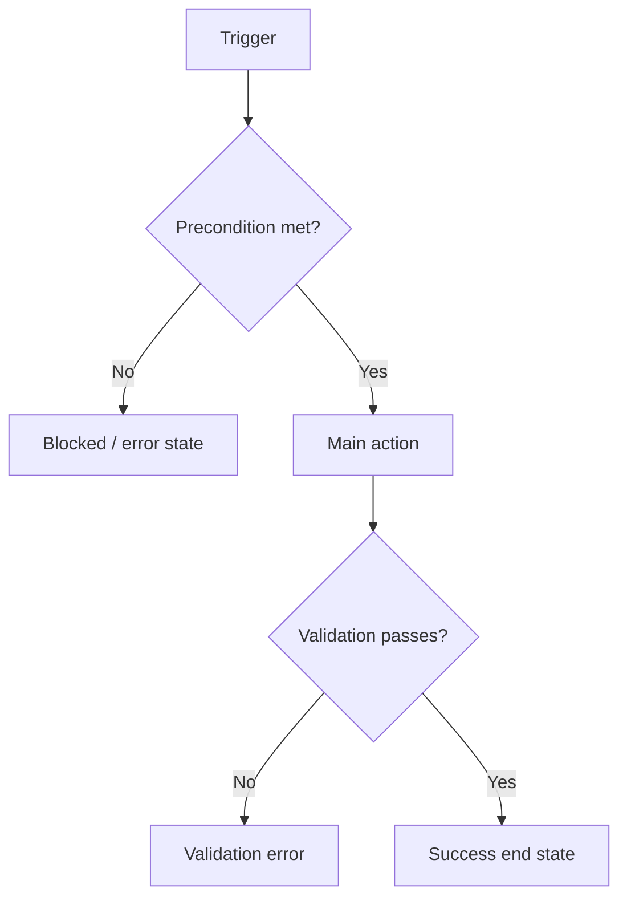

# [Feature/Epic Name] — Epic / PRD (UI-feature archetype)

*Use when the epic ships a user-facing surface. Structure mirrors BCLOUD-12164. If the epic also does real backend/data work (e.g. its logging pipeline), it's a **hybrid** — also pull the relevant middle block from `backend-epic-template.md`. Heavy vs light is handled by which optional sections/columns you keep, not by switching templates.*

---
```yaml
doc_type: epic-prd
archetype: ui-feature        # ui-feature | backend-platform | hybrid
status: draft
product_area: [Product/App Name]
jira_epic_link: ""
confluence_link: ""
author: [PM/BA]
created_date: YYYY-MM-DD
last_updated: YYYY-MM-DD
```
---

## 1. Problem Statement & Background

### 1.1 Epic context
[Jira epic smartlink.] What exists today, what this epic introduces, and the one-paragraph shape of the change. Name any load-bearing concept precisely (e.g. one-directional block-only override).

### 1.2 Objectives
Numbered objectives.

**Target Users (Personas):**
- **Primary:** [role] — needs, friction.
- **Secondary / Tertiary:** [role] — needs.

### 1.3 Problem Description
What's broken/missing today and why the current lever is insufficient. A concrete example (support volume, screenshot, complaint) if one exists.

### 1.4 In Scope / Out of Scope
- **In scope:** explicit list of what this epic delivers.
- **Out of scope:** explicit exclusions — especially things that *sound* related but belong to a parent, a dependency, or a future epic. A scope visual helps.

### 1.5 Success Metrics *(mandatory)*
| Metric | Baseline | Target | Timeline | Measurement Method | Confidence / Note |
|--------|----------|--------|----------|--------------------|-------------------|
| | | | | | measurable-now / instrumentation-gated |

**Leading indicators:** [early signals].

### 1.6 User Experience — User Stories / Use Cases
Per surface/persona: `US-A`, `US-B`, … As a [persona], I want [action], so that [benefit], with the key behavioral bullets under each.

---

## 2. Activity Diagrams
*(One per major flow/surface. Confirm format with the PM: Mermaid (default) / Lucid prompt / other. MUST include negative paths.)*



---

## 3. UX / UI Design Notes
**Design link:** [Figma, or "reuse existing pattern — modeled on <shipped pattern>", or "N/A"]. Note prototype-first where relevant. Key design considerations (component reuse, pattern parity).

---

## 4. GUI Data Dictionary
*(Mandatory for every UI element in scope. One row per element. Convert prose field descriptions into rows — do not accept prose as a substitute.)*

| Screen | User Story | Element | Type | Label | Hint/Tooltip | Mandatory (Y/N) | Editable (Y/N) | Default State | List of Values | Validation Rule | Error Message | Localization (Y/N) | Notes |
|--------|-----------|---------|------|-------|--------------|-----------------|----------------|---------------|----------------|-----------------|--------------|--------------------|-------|
| | | | Text/Dropdown/Checkbox/Button/… | | | | | Enabled/Disabled/Hidden | values or source | format/range/logic | exact copy | | |

*Light-UI epics may omit Hint/Default/List/Validation/Error columns where genuinely N/A — but keep Screen, US, Element, Type, Label, Editable, Localization, Notes. State that you're using the reduced set.*

---

## 5. Functional Requirements
*(Namespaced IDs. BDD is the last column, after Informal Acceptance Criteria.)*

| Surface/Area | Category | Req ID | Requirement | Priority | Informal Acceptance Criteria | BDD Scenario(s) |
|--------------|----------|--------|-------------|----------|------------------------------|-----------------|
| Self-Service | Edit tab | SS.FR-1 | [what it does] | Must / Should / Nice | [testable condition] | `Scenario: … Given … When … Then …` (happy + negative, referencing EC IDs) |

*Priority: Must = MVP, Should = V1, Nice = future.*

---

## 6. Permissions
| Persona | Role | Screen / Action | View | Edit | Notes |
|---------|------|-----------------|------|------|-------|
| | | | Y/N | Y/N | |

---

## 7. Edge Cases
*(Own section; namespaced IDs. Negative-path Gherkin lives in the FR BDD column, referenced by EC ID.)*

| User Story | Edge Case ID | Scenario | Expected Behavior |
|------------|--------------|----------|-------------------|
| | SS.EC-1 | [record deleted mid-flow / duplicate submit / permission change mid-session / empty result] | [what the system does] |

---

## 8. Non-Functional Requirements
| Category | Requirement | Details |
|----------|-------------|---------|
| Performance | | |
| Data consistency | | |
| Real-time sync | | |
| Accessibility | WCAG 2.1 AA | new UI elements |
| Extensibility | | |
| Security | authn / authz | |

---

## 9. Logging / Telemetry *(mandatory — see references/logging-telemetry.md)*
Activity logging (customer-facing) vs Audit logging (system-of-record); field-level dictionary (9.1); canonical event names (9.2); reference the company Logging & Monitoring Standard.

---

## 10. Backend / API Notes
*(Working direction, not a rigid contract — engineering owns the final contract. Candidate endpoints as suggestions/questions are fine.)*

| Screen / Area | Working Direction |
|---------------|-------------------|
| | Extend existing endpoint … |

**Standing rule:** any frontend search/filter/sort capability requires matching backend query support (pagination/filter params) by default. Deferring it must be a logged decision with an owner, never a silent gap. *(Use the strict API-integration contract table from `backend-epic-template.md` only if this epic exposes an endpoint to external consumers.)*

---

## 11. Analytics (Product Usage) *(distinct from Logging/Telemetry)*
| Event Name | Area/Type (FE/BE) | Fires On | Required Properties | Notes |
|------------|-------------------|----------|---------------------|-------|

**Tool / naming convention:** [Amplitude; `Area: Human-Readable Action`]. If the area isn't instrumented yet, defer and park in a common backlog item rather than blocking the epic.

---

## 12. Localization
New user-facing strings must be localizable wherever the surface is localized. List supported languages and any language deferred to a later phase.

---

## 13. AI, RAG & MCP — Assessment & Extension *(mandatory gate)*
| Question | Answer | Rationale |
|----------|--------|-----------|
| AI needed at all? | Y/N | |
| If yes: one-shot / orchestration / agent? | | |
| RAG needed (or extending existing)? | Y/N | |
| MCP interface needed (or extending existing)? | Y/N | |

*If this epic is a first-time RAG or MCP build, complete the corresponding dictionary from `references/backend-subtypes.md`.*

---

## 14. Dependencies & Rollout
**Dependencies** *(Jira issue links — "blocks"/"depends on" — not prose):*
| Dependency | Type | Jira Link | Status |
|------------|------|-----------|--------|

**Risks & mitigations** *(recommended — prompt the PM):* Risk / Impact / Likelihood / Mitigation.

**Rollout & rollback** *(recommended — prompt the PM):* strategy, kill switch, rollback steps.

**Launch checklist / Glossary / Support-CS enablement** *(optional — prompt the PM).*

---

## 15. Open Questions
*(Simple Q → A. Inline answer when known. Owner/status optional.)*

- **OQ-1:** [question] — **A:** [answer or "open"]
- **OQ-2:** [question] — **A:** …

---
**Status:** Draft | In Review | Approved | In Progress | Completed
